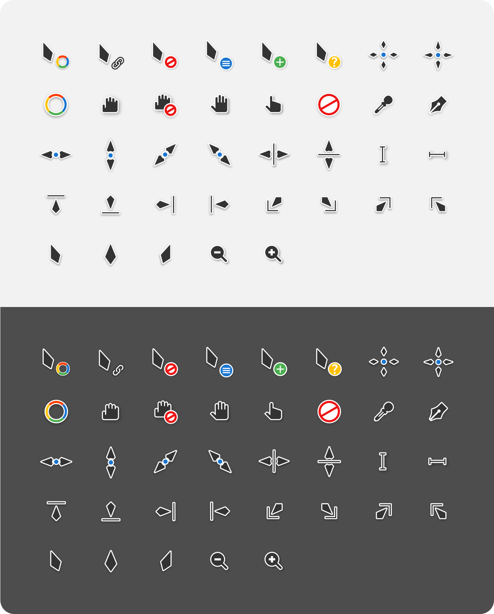
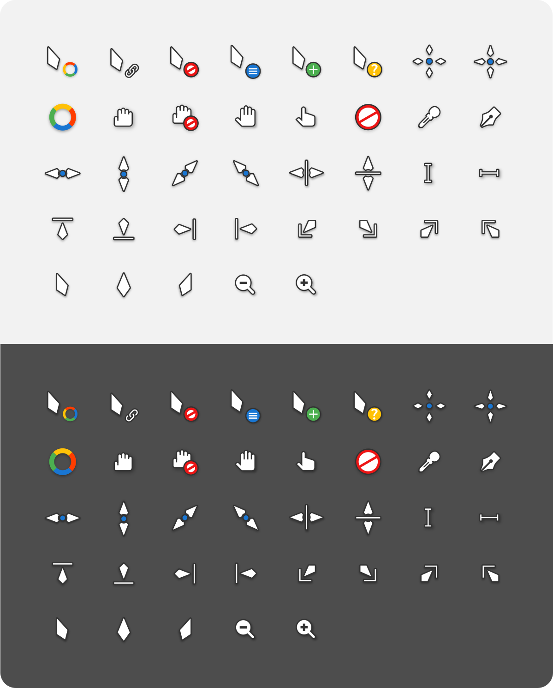

# Vimix cursors
This is an x-cursor theme inspired by Materia design and
based on [capitaine-cursors](https://github.com/keeferrourke/capitaine-cursors).

## Installation
To install the cursor theme simply copy the compiled theme to your icons
directory. For local user installation:

```
./install.sh
```

For system-wide installation for all users:

```
sudo ./install.sh
```

Then set the theme with your preferred desktop tools.

### Windows

The Windows build comes with an INF file to make installation easy.

 1. Open `.windows/` in Explorer, and right click on `install.inf`.
 2. Click 'Install' from the context menu, and authorise the modifications to your system.
 3. Open `Control Panel` > `Personalisation and Appearance` > `Change mouse pointers`, and select Capitaine cursors.
 4. Click 'Apply'.

## Building from source
You'll find everything you need to build and modify this cursor set in
the `src/` directory. To build the xcursor theme from the SVG source
run:

```
./build.sh
```

This will generate the pixmaps and appropriate aliases.
The freshly compiled cursor theme will be located in `dist/`

### Building depends requirment
- xorg-xcursorgen.
- python-cairosvg.

Fedora/RedHat distros:

    dnf install xorg-xcursorgen python-cairosvg

Ubuntu/Mint/Debian distros:

    sudo apt-get install xorg-xcursorgen python-cairosvg

ArchLinux/Manjaro:

    pacman -S xorg-xcursorgen python-cairosvg

Other:
Search for the engines in your distributions repository or install the depends from source.

## Preview


